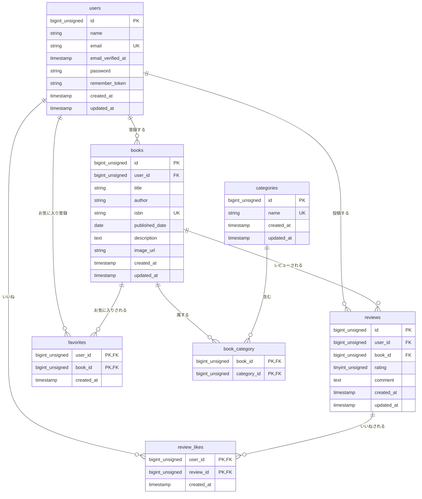

## ER図

```mermaid
erDiagram
    users ||--o{ books : "登録する"
    users ||--o{ reviews : "投稿する"
    users ||--o{ favorites : "お気に入り登録"
    users ||--o{ review_likes : "いいね"

    books ||--o{ reviews : "レビューされる"
    books ||--o{ favorites : "お気に入りされる"
    books ||--o{ book_category : "属する"

    categories ||--o{ book_category : "含む"

    reviews ||--o{ review_likes : "いいねされる"

    users {
        bigint_unsigned id PK
        string name
        string email UK
        timestamp email_verified_at
        string password
        string remember_token
        timestamp created_at
        timestamp updated_at
    }

    categories {
        bigint_unsigned id PK
        string name UK
        timestamp created_at
        timestamp updated_at
    }

    books {
        bigint_unsigned id PK
        bigint_unsigned user_id FK
        string title
        string author
        string isbn UK
        date published_date
        text description
        string image_url
        timestamp created_at
        timestamp updated_at
    }

    book_category {
        bigint_unsigned book_id PK, FK
        bigint_unsigned category_id PK, FK
    }

    reviews {
        bigint_unsigned id PK
        bigint_unsigned user_id FK
        bigint_unsigned book_id FK
        tinyint_unsigned rating
        text comment
        timestamp created_at
        timestamp updated_at
    }

    favorites {
        bigint_unsigned user_id PK, FK
        bigint_unsigned book_id PK, FK
        timestamp created_at
    }

    review_likes {
        bigint_unsigned user_id PK, FK
        bigint_unsigned review_id PK, FK
        timestamp created_at
    }
```
