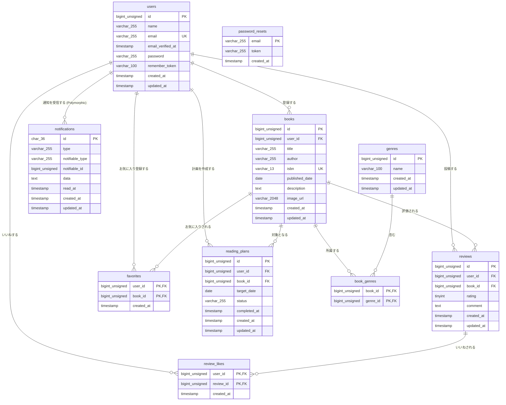

# COACHTECH 書籍レビューアプリ BookShelf

本システムは、書籍レビューアプリケーション「BookShelf」です。
ユーザーは書籍を登録・閲覧し、レビューの投稿やお気に入り登録ができます。
ジャンルによる分類やレビューへのいいね機能、平均評価に基づくランキング機能も備えています。
外部アプリケーション向けの公開API（JSON）も提供します。

## 作成者

宮本京子

## 使用技術

- PHP 8.2
- Laravel 10.x
- MySQL 8.0
- Nginx
- Docker / Docker Compose / Laravel Sail
- Vite / Tailwind CSS 3.4
- Laravel Fortify（認証）
- phpMyAdmin

## ER図



## 開発環境URL

http://localhost

## 動作環境

- Docker
- Docker Compose

※ Windowsの場合はWSL2の利用を推奨します。

## 環境構築手順

1. **リポジトリをクローン**

   ```bash
   git clone https://github.com/kyomiya0220/COACHTECH_BookShelf
   ```

2. **.envファイルの準備**

   `.env.example` をコピーして `.env` を作成します。

   ```bash
   cp .env.example .env
   ```

   `.env` ファイル内の以下のDB接続情報を確認・設定します。`.env.example` のデフォルト値はSail向けではないため、以下のように変更してください。

   ```ini
   DB_CONNECTION=mysql
   DB_HOST=mysql
   DB_PORT=3306
   DB_DATABASE=laravel
   DB_USERNAME=sail
   DB_PASSWORD=password

   ```

3. **Composer依存パッケージのインストール**

   プロジェクトの初回セットアップ時は、`vendor` ディレクトリが存在しないため `sail` コマンドを使用できません。
   以下のDockerコマンドを実行して、コンテナ内で `composer install` を実行します。

   ```bash
   docker run --rm \
       -u "$(id -u):$(id -g)" \
       -v "$(pwd):/var/www/html" \
       -w /var/www/html \
       laravelsail/php82-composer:latest \
       composer install --ignore-platform-reqs
   ```

4. 本プロジェクトでは、フロントエンドのスタイリングにTailwind CSSを使用します。
   以下の手順でセットアップを行ってください。

### 1. NPM依存パッケージのインストール

sail npm install
※Sailコンテナが起動していることを確認。起動していない場合は ./vendor/bin/sail up -d を実行

### 2. Alpine.jsのインストール

sail npm install alpinejs

### 3. Tailwind CSSと @tailwindcss/forms プラグインのインストール

sail npm install -D tailwindcss@^3.4.0 @tailwindcss/forms postcss autoprefixer
※ @tailwindcss/forms はフォーム要素のスタイルをリセットするLaravel標準プラグインです。

### 4. 設定ファイルの生成

sail npx tailwindcss init -p

### 5. Tailwind CSSのテンプレートパス設定とforms プラグインの有効化

tailwind.config.js を以下の内容で上書きしてください：

```bash
import defaultTheme from 'tailwindcss/defaultTheme';
import forms from '@tailwindcss/forms';

/** @type {import('tailwindcss').Config} _/
export default {
content: [
'./vendor/laravel/framework/src/Illuminate/Pagination/resources/views/_.blade.php',
'./storage/framework/views/\*.php',
'./resources/views/**/\*.blade.php',
],
theme: {
extend: {
fontFamily: {
sans: ['Figtree', ...defaultTheme.fontFamily.sans],
},
},
},
plugins: [forms],
};
```

### 6.Vite開発サーバーの起動

sail npm run dev
注意: 開発中は常にこのコマンドを実行した状態にしておいてください。

5. **Laravel Sailの起動**

   以下のコマンドでDockerコンテナを起動します。

   ```bash
   ./vendor/bin/sail up -d
   ```

   > **エイリアスの設定（推奨）**
   >
   > 毎回 `./vendor/bin/sail` と入力するのは手間なので、エイリアスを設定すると便利です。
   >
   > ```bash
   > alias sail='[ -f sail ] && bash sail || bash vendor/bin/sail'
   > ```

6. **アプリケーションキーの生成**

   ```bash
   sail artisan key:generate
   ```

7. **データベースのマイグレーションと初期データ投入**

   以下のコマンドでテーブルを作成し、ダミーデータを投入します。

   ```bash
   sail artisan migrate:fresh --seed
   ```

   このコマンドの入力後、下記のエラーが表示されることがあります。

   ```bash
      Illuminate\Database\QueryException
     SQLSTATE[HY000] [1044] Access denied for user 'sail'@'%' to database 'contact-form-app' (Connection: mysql, SQL: select table_name as `name`,         (data_length + index_length) as `size`, table_comment as `comment`, engine as `engine`, table_collation as `collation` from information_schema.tables where table_schema = 'contact-form-app' and table_type in ('BASE TABLE', 'SYSTEM VERSIONED') order by table_name)

     at vendor/laravel/framework/src/Illuminate/Database/Connection.php:829
       825▕                     $this->getName(), $query, $this->prepareBindings($bindings), $e
       826▕                 );
       827▕             }
       828▕
     ➜ 829▕             throw new QueryException(
       830▕                 $this->getName(), $query, $this->prepareBindings($bindings), $e
       831▕             );
       832▕         }
       833▕     }

     +43 vendor frames

     44  artisan:35
         Illuminate\Foundation\Console\Kernel::handle()
   ```

   このエラーはコンテナ内にデータが残っており、エラーが生じているケースなどがあります。
   その場合は、以下のコマンドを順に実行して各コンテナを再起動して下さい。

   ```Bash
   sail down -v
   sail up -d　//コマンド実行後にSQLコンテナが立ち上がるまで時間がかかります。30秒ほどお待ちください。
   sail artisan migrate:fresh --seed
   ```

8. **アプリケーションへのアクセス**

   ブラウザで [http://localhost](http://localhost) にアクセスします。

## テスト実行

```bash
sail artisan test
```

カバレッジ付きで実行する場合:

```bash
sail artisan test --coverage
```

## 機能一覧

### 1. ユーザー認証機能

- **会員登録 (`GET/POST /register`)**
  - 名前、メールアドレス、パスワードによる登録
  - パスワード確認、各種バリデーションエラーメッセージの日本語対応
  - 登録成功時、書籍一覧へリダイレクト（「ユーザー登録が完了しました。」のメッセージ表示）
- **ログイン・ログアウト (`GET/POST /login`, `POST /logout`)**
  - レート制限（5回/分）：超えた場合は `429 Too Many Requests` を返却
  - ログイン済みユーザーが `/login`, `/register` にアクセスした場合は書籍一覧（`/`）へリダイレクト
  - ログアウト時にフラッシュメッセージを表示（「ログアウトしました。」）

### 2. 書籍管理機能

- **書籍一覧（トップ） (`GET /` または `GET /books`)**
  - ゲスト閲覧可能 / ページネーション（10件/ページ）
  - **★ 応用：キーワード検索 (`?keyword=xxx`)**：タイトル・著者の部分一致（全角/半角スペース自動トリム）
  - **★ 応用：ジャンル絞り込み (`?genre=xxx`)**：選択ジャンルの書籍のみ表示（存在しないID指定時は0件表示）
  - **★ 応用：ソート切り替え (`?sort=xxx`)**
    - `newest`（デフォルト）：登録日が新しい順
    - `oldest`：登録日が古い順
    - `title`：タイトル昇順
    - `rating`：評価が高い順（レビュー未投稿の書籍は一覧の最後に表示、同順位は登録順）
- **書籍詳細 (`GET /books/{book}`)**
  - 詳細情報（タイトル、著者、ISBN、出版日、説明、画像、ジャンル、レビュー一覧、いいね数）を表示
  - 未認証時も「編集」「削除」ボタンは表示（押下時にログイン画面へリダイレクト）
- **書籍登録 (`GET/POST /books`)**
  - **★ 応用：ISBN自動入力 API (`GET /books/isbn/{isbn}`)**：13桁ISBN入力で Google Books API から書籍情報を補完
  - `FormRequest` による厳格なバリデーション（ISBN13桁一意性、本日以前の出版日など）
- **書籍編集・削除 (`GET/PUT /books/{book}/edit`, `DELETE /books/{book}`)**
  - 作成者本人（Policyによる認可）のみ実行可能（他人は `403 Forbidden`）
  - 削除時、関連データ（レビュー・お気に入り・ジャンル紐付け）をカスケード処理

### 3. レビュー・お気に入り機能

- **お気に入りトグル (`POST /books/{book}/favorites`)**
  - 認証必須（未認証時はログイン画面へリダイレクト＋メッセージ）
- **レビュー投稿・編集・削除 (`POST /books/{book}/reviews`, `PUT/DELETE /reviews/{review}`)**
  - 投稿者本人のみ編集・削除可能
  - レビューに対する「いいね」トグル機能 (`POST /reviews/{review}/like`)

### 4. マイページ・各種管理機能

- **お気に入り一覧 (`GET /favorites`)** / **ジャンル管理 (`GET/POST/PUT/DELETE /genres`)**
  - 紐づく書籍が存在するジャンルの削除制限
- **ランキング画面 (`GET /ranking`)**
  - レビュー平均評価 TOP10（レビュー件数1件以上）を降順表示
- **★ マイ読書レポート (`GET /reports`)**
  - 基本サマリー（総レビュー数、読了冊数、平均評価点）
  - 評価分布（1〜5星の横バー表示）
  - 高評価書籍 TOP5 / ジャンル別評価傾向 TOP5

### 5. ★ 読書計画管理・通知・日次バッチ機能

- **読書計画 CRUD (`/reading-plans`)**
  - 状態（進行中/読了/期限切れ）による絞り込み・完了処理・更新・削除
  - 同一書籍に対する重複登録防止（進行中の計画が存在する場合はエラー）
- **通知一覧 (`GET /notifications`, `POST /notifications/{id}/read`)**
  - ヘッダーのベルアイコンに未読バッジを表示
- **日次バッチ処理 (`Schedule 経由`)**
  - 毎日 20:00（または 00:00）に自動実行
  1. 期日経過した `in_progress` 計画を `Expired (overdue)` に一括更新
  2. 期日3日前の計画へ予告通知 (`PlanReminderNotification`) を発火
  3. 期日当日の計画へ最終リマインド通知を発火
  4. 期日3日後の Expired 計画へ再エンゲージメント通知を発火

---

## 📡 公開 API 仕様書 (`/api/v1`)

基礎段階では全エンドポイントが**認証不要**ですが、応用段階で **Laravel Sanctum トークン認証** および **Policy 認可** を導入します。

### エンドポイント一覧

| HTTPメソッド | URI                    | 概要               | 認証（基礎） |        認証（応用）        |
| :----------- | :--------------------- | :----------------- | :----------: | :------------------------: |
| **GET**      | `/api/v1/books`        | 書籍一覧を取得する |     不要     |            不要            |
| **GET**      | `/api/v1/books/{book}` | 書籍詳細を取得する |     不要     |            不要            |
| **POST**     | `/api/v1/books`        | 書籍を新規登録する |     不要     |     **★ Sanctum 必須**     |
| **PUT**      | `/api/v1/books/{book}` | 書籍を更新する     |     不要     | **★ Sanctum + BookPolicy** |
| **DELETE**   | `/api/v1/books/{book}` | 書籍を削除する     |     不要     | **★ Sanctum + BookPolicy** |

---

### AP01: 書籍一覧 API

- **Endpoint:** `GET /api/v1/books`
- **Query Parameters:**
  - `keyword` (string, optional): タイトル・著者名の検索キーワード (max:255)
  - `category_id` (integer, optional): ジャンル（カテゴリ）ID
  - `page` (integer, optional): ページ番号 (min:1)
  - `per_page` (integer, optional): 1ページあたりの件数 (min:1, max:100)
- **Response (200 OK):**

```json
{
  "data": [
    {
      "id": 1,
      "title": "Laravel入門",
      "genre": { "id": 3, "name": "プログラミング" },
      "avg_rating": 4.5,
      "reviews_count": 12,
      "reviews": [{ "id": 1, "comment": "わかりやすいです", "stars": 5 }]
    }
  ]
}
```
